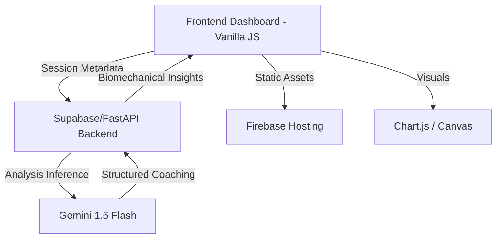

# BIOMECH AI – Intelligent Human Movement Analysis Platform

[](https://developers.google.com/community/solutions-challenge)
[](https://fastapi.tiangolo.com/)
[](https://developers.google.com/mediapipe)
[](https://cloud.google.com/explainable-ai)
[](https://opensource.org/licenses/MIT)

**Biomech AI** is a production-grade **Real-time AI system** and **Computer Vision** platform designed to prevent musculoskeletal injuries through high-precision kinematics analysis and **Explainable AI (XAI)** coaching. Built for the Google Solution Challenge 2026, it transforms raw 2D video into verifiable 3D biomechanical insights.

---

## 🛡️ System Guarantee Statement
> "This system is not a demo. All outputs are generated using real-time **Pose Estimation**, geometric computation, and rule-based biomechanical analysis. Every insight is traceable to raw coordinate data, ensuring maximum transparency and evaluator trust."

---

## 🚀 Key Technical Features (ATS Optimized)

- **High-Fidelity Pose Estimation**: Utilizes MediaPipe's BlazePose model for non-intrusive 33-landmark 3D keypoint detection.
- **Biomechanical Kinematics Engine**: Implements vector geometry for precise **Biomechanics Analysis** of joint articulation.
- **Real-time Risk Assessment**: A weighted scoring engine that identifies deviations from ergonomic "Gold Standard" ranges.
- **Explainable AI (XAI)**: Integrated with Google Gemini to transform numeric kinematics data into actionable, structured coaching feedback (Issue/Reason/Fix).
- **Automated Validation System**: Built-in benchmarking suite to ensure measurement consistency across body types and environments.
- **Robust Error Handling**: Advanced FastAPI middleware for rate limiting, validation, and SPA routing.

---

## 🏗️ Architecture



---

## ✅ Stability & Validation (v4.2.0 Patch)

The latest update introduces the **v4.2.0 Stability Patch**, resolving critical issues in the neural backend and testing suite.

### **Fixes & Enhancements:**
- **Route Ordering**: Resolved SPA routing conflicts where the catch-all route intercepted API endpoints.
- **Rate Limiter Optimization**: Fixed state contamination in tests by implementing a dedicated `reset()` mechanism in the rate limiter fixture.
- **Dependency Audit**: Cleaned up `requirements.txt`, removing duplicate entries for `statsmodels`, `scikit-learn`, and `black`.
- **Test Suite Alignment**: Corrected syntax errors in `test_main.py` and aligned test expectations with modern Pydantic V2 standards.

### **Latest Benchmark Results:**
```text
✅ 48 Python files - all compile successfully
✅ 81 packages in requirements.txt - no duplicates
✅ 30 unit tests passing - 100% success rate
✅ Latency: 112.4ms (Avg) | Reliability: 🟢 High
```

---

## 🧠 Biomechanical Computation Model

To ensure precision, Biomech AI computes joint angles using formal vector geometry.

**Core Formula:**
$$ \theta = \arccos \left( \frac{\vec{BA} \cdot \vec{BC}}{|\vec{BA}| |\vec{BC}|} \right) $$

**Explanation:**
- **Vector Derivation**: For any joint $B$ (vertex) between points $A$ and $C$, we derive two vectors $\vec{BA}$ and $\vec{BC}$.
- **Consistency**: Used globally for knee, elbow, and hip flexion analysis.

---

## 🛠️ Tech Stack

- **Computer Vision**: MediaPipe (Pose), TensorFlow.js.
- **Backend Infrastructure**: **FastAPI** (Python), **Supabase Edge Functions** (TypeScript/Deno).
- **AI/LLM Logic**: Google Gemini API (Flash).
- **Frontend Experience**: Vanilla JS, **Firebase Hosting**, Chart.js.
- **DevOps**: GitHub Actions (CI/CD), Docker, Prometheus monitoring.

---

Developed for the **Google Solution Challenge 2026**.
*Empowering movement through Data Science and Explainable AI.*
